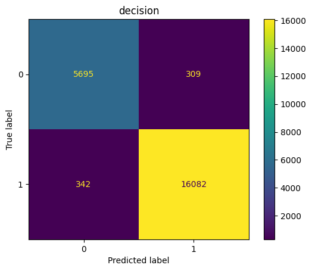

# Fish Life Prediction

Creating Machine Learning to predict if fish can live in stated water environment

# Column Consideration

### Nitrate Concentration (NITRATE):

    Represents the concentration of nitrate in parts per million (PPM). High nitrate levels can indicate pollution, affecting fish health.

### pH Level (PH):

    pH measures the acidity or alkalinity of the water. Fish have specific pH preferences, and deviations can impact their physiological processes.

### Ammonia Concentration (AMMONIA):

    Indicates the concentration of ammonia in milligrams per liter (mg/l). Ammonia levels are critical as high concentrations are toxic to fish.

### Water Temperature (TEMP):

    The temperature of the water in Celsius. Fish have temperature preferences, and extremes can affect their metabolic rates and behavior.

### Dissolved Oxygen Content (DO):

    Measures the amount of oxygen dissolved in water. Fish rely on dissolved oxygen for respiration, and low levels can lead to stress or suffocation.

# Scaler

### Robust Scaler

    Scaler that tolerate outlier and skewed distribution

# Model

### Logistic Regression (logic):

    Explanation: Despite its name, logistic regression is a linear model used for binary classification tasks. It predicts the probability that an instance belongs to a particular class using a logistic function. It's widely used due to its simplicity, interpretability, and efficiency, especially when the relationship between features and the target variable is linear or nearly linear.
    Applications: Commonly used in various fields such as finance (e.g., credit risk modeling), healthcare (e.g., disease diagnosis), marketing (e.g., customer churn prediction), and more.

### K-Nearest Neighbors (knn):

    Explanation: KNN is a non-parametric and instance-based learning algorithm used for classification and regression tasks. It classifies a data point based on the majority class among its k nearest neighbors in the feature space. It's simple to understand and implement but can be computationally expensive for large datasets.
    Applications: Used in recommendation systems, pattern recognition, anomaly detection, and other fields where proximity-based classification or regression is applicable.

### Support Vector Classification (svc):

    Explanation: SVC is a type of support vector machine (SVM) used for classification tasks. It finds the hyperplane that best separates the classes in the feature space while maximizing the margin between them. It's effective in high-dimensional spaces and is versatile due to its ability to handle non-linear decision boundaries through kernel tricks.
    Applications: Widely used in text classification, image recognition, bioinformatics, and other domains where complex decision boundaries are present.

### Decision Tree Classifier (decision):

    Explanation: Decision trees are a non-parametric supervised learning method used for classification and regression tasks. They recursively split the feature space into regions, making decisions at each node based on feature values. They're intuitive to interpret and can handle both numerical and categorical data.
    Applications: Used in a wide range of domains including healthcare (e.g., medical diagnosis), finance (e.g., credit scoring), and marketing (e.g., customer segmentation), where decision-making processes can be represented as a tree-like structure.

# Best Model

    Decision Tree Classifier with parameter criterion='entropy'and max_depth=10 with Robust Scaler.

# Evaluation

### Classification Report

```
==================== decision ====================
              precision    recall  f1-score   support

         0.0       0.94      0.95      0.95      6004
         1.0       0.98      0.98      0.98     16424

    accuracy                           0.97     22428
   macro avg       0.96      0.96      0.96     22428
weighted avg       0.97      0.97      0.97     22428
```

### Confusion Matrix



# Conclusion

Decision Tree Classification are model that be choosen because it good on large Data. This model has high precision with moderate False Positive. This model are good for evaluate water quality for each beach teritory in maritime country.
